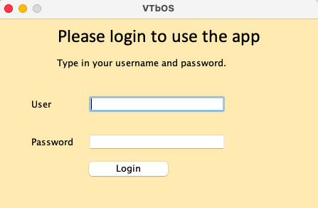

# Vokabeltrainer

---

---
Dear Reader,

this is a vocabulary trainer in its early alpha state.

This is a school project, so pardon me, if it's a little crappy or something.

I shall not intend to explain every single bit of my code, as is it kinda komplex. Comments help, yes, sometimes there are some...

Anyway have fun.

You can download this project by clicking on the "Code" Button and then download as zip or just use the commandline tool "git" (git clone https://github.com/Rolexander/Vokabeltrainer.git). Oh and you need to install Java on your machine, where you wanna start this app.

Hope it's somewhat useful to some of you.
